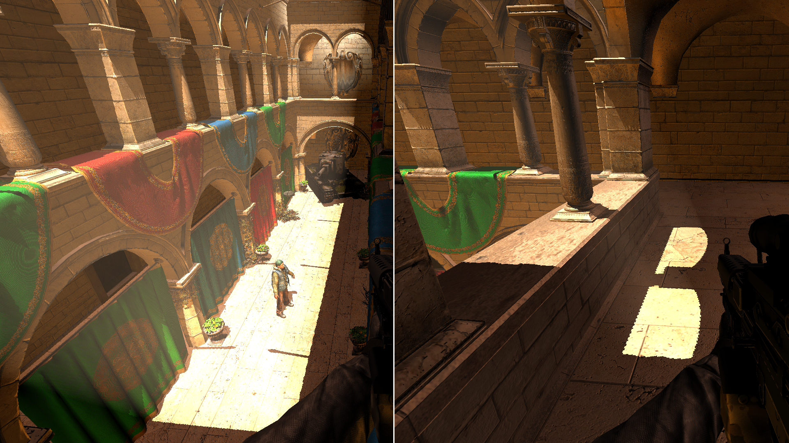

## What is Makma?

Makma is a Vulkan benchmark. It features a four-pass deferred renderer, cascaded shadow mapping, metal/roughness material setup, volumetric lighting, bloom, directional, point and spotlights, in-depth performance graphs (per pass) and a large options menu to customize the benchmark on the fly.

## How do I run Makma?

Grab the latest build from the [releases page](https://github.com/janhsimon/makma/releases).

Here are the system requirements for running Makma:

| **Category**     | **Requirement**          | **Notes**                                   |
| ---------------- | ------------------------ | ------------------------------------------- |
| Operating System | Windows or Linux, 64-bit | Tested on Windows 10 and Ubuntu 20.04       |
| Graphics Card    | 2GB video memory or more | Tested on NVIDIA GTX 760 and 1050 Ti Mobile |
| Graphics Driver  | Vulkan 1.2 support       |                                             |

## How do I build Makma?

In addition to the system requirements for running Makma, you will need the following to build the project:

<<<<<<< HEAD
| **Category**         | **Requirement**           |
| -------------------- | ------------------------- |
| Graphics API         | Vulkan 1.2.170 SDK        |
| Build Generator      | CMake 3.2 or newer        |
| C++ Compiler         | Windows: MSVC 19.28.29914 |
|                      | Linux: GCC 9.3.0          |
=======
| **Category**         | **Requirement**          | **Notes**                                |
| -------------------- | ------------------------ | ---------------------------------------- |
| Graphics API         | Vulkan 1.2.170 SDK       | Other versions may require code changes  |
| C++ Compiler         | C++17-compatible, 64-bit | Tested on MSVC 19.28.29914 and GCC 9.3.0 |
| Build Generator      | CMake 3.1 or newer       |                                          |
>>>>>>> b4f5bfdf7e333a4cc6ecb754447be4923d596cbd

Makma is set up as a standard CMake project. Once the above requirements are installed, you can simply clone this repository and generate build files for your toolchain and platform. All required libraries are provided as binaries in the `external` folder, the only outside dependency is the Vulkan SDK.

Make sure to build the `INSTALL` CMake target before running Makma. This is required to copy the required files (shared libraries and program resources) into your build folder.
